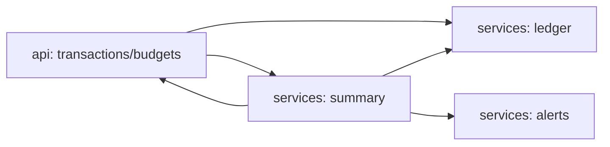

# agent-personal-finance

[](https://github.com/Shamanchi/agent-personal-finance/actions/workflows/ci.yml)
[](https://www.python.org/)
[](./Dockerfile)
[](./LICENSE)

> **English TL;DR:** FastAPI personal finance agent: income/expense ledger, monthly budgets per category, monthly summary with savings rate, and over-budget alerts. Fully offline, no tokens needed.

Агент личных финансов: учёт доходов и расходов, месячные бюджеты по категориям, сводка за месяц с нормой сбережений и алерты о превышении. Работает офлайн.

Источник темы: `Hands-On-AI-Engineering / P-137 (personal_finance_agent)` — идею и постановку взяли из каталога, код и тексты написаны с нуля.

## Какую задачу решает

Нужно понять, куда уходят деньги: записать доходы/расходы, задать лимиты по категориям (еда, транспорт), получить сводку за месяц и вовремя увидеть превышения. Агент считает всё сам и подсвечивает проблемные категории.

## Архитектура



Слои: `api/` → `services/` → `core/`, настройки через `pydantic-settings`.

## Быстрый старт

```bash
cp .env.example .env
pip install -r requirements.txt
uvicorn app.main:app --reload
curl -X POST http://127.0.0.1:8000/api/v1/transactions -H "Content-Type: application/json" -d "{\"kind\": \"expense\", \"amount\": 500, \"category\": \"food\", \"date\": \"2026-09-05\"}"
curl "http://127.0.0.1:8000/api/v1/summary?month=2026-09"
```

Docker:

```bash
docker compose up --build
```

## API

- `GET /api/v1/health` — проверка сервиса.
- `POST /api/v1/transactions` — записать операцию. Тело: `{"kind": "income"|"expense", "amount": 500, "category": "food", "date": "2026-09-05", "note": "..."}`.
- `GET /api/v1/transactions` — список операций, фильтр `?month=2026-09&kind=expense`.
- `POST /api/v1/budgets` — задать лимит: `{"category": "food", "monthly_limit": 15000}`.
- `GET /api/v1/budgets` — текущие лимиты.
- `GET /api/v1/summary?month=2026-09` — сводка: доходы, расходы, сбережения, норма сбережений, траты по категориям, статус бюджетов.
- `GET /api/v1/alerts?month=2026-09` — превышения лимитов.

Пример ответа `summary` (сокращённо):

```json
{
  "month": "2026-09",
  "income": 100000.0,
  "expenses": 25000.0,
  "savings": 75000.0,
  "savings_rate": 0.75,
  "by_category": {"food": 20000.0, "transport": 5000.0},
  "budgets": [{"category": "food", "limit": 15000.0, "spent": 20000.0, "over": true}]
}
```

## Переменные окружения (.env)

| Переменная | Назначение | По умолчанию |
|---|---|---|
| `DEFAULT_CURRENCY` | Валюта отчётов | `RUB` |
| `DEFAULT_MONTH` | Месяц по умолчанию (`YYYY-MM`) | `2026-09` |
| `APP_HOST` / `APP_PORT` | Хост/порт API | `0.0.0.0` / `8000` |

Полный список — в [.env.example](./.env.example).

## Тесты

```bash
pip install -r requirements.txt
pytest -q
pytest -q -m integration
```

Unit-тесты без сети. Интеграционные (`-m integration`) — через TestClient, тоже без сети.

## Контакты

- Telegram: @PavelYrevichh
- Email: Lietman46@mail.ru
- GitHub: Shamanchi
- FL.ru: https://www.fl.ru/users/Shamanchi
